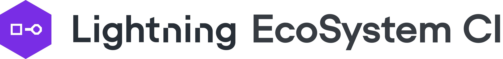

**Automated Testing for Lightning EcoSystem Projects**

[](https://pytorchlightning.ai)
[](https://github.com/PyTorchLightning/ecosystem-ci/actions/workflows/ci_test-acts.yml)
[](https://codecov.io/gh/PytorchLightning/ecosystem-ci)
[](https://results.pre-commit.ci/latest/github/PyTorchLightning/ecosystem-ci/main)

______________________________________________________________________

<div align="center">
Automate issue discovery for your projects against Lightning nightly and releases.
<br / >
You get CPUs, Multi-GPUs testing for free, and Slack notification alerts if issues arise!
</div>

## How do I add my own Project?

### Pre-requisites

Here are pre-requisites for your project before adding to the Lightning EcoSystem CI:

- Your project already includes some **Python tests with PyTorch Lightning** as a dependency
- You'll be a **contact/responsible** person to resolve any issues that the CI finds in the future for your project

### Adding your own project config

1. First, fork this project (with [CLI](https://cli.github.com/) or in browser) to be able to create a new Pull Request, and work within a specific branch.
   ```bash
   gh repo fork PyTorchLightning/ecosystem-ci
   cd ecosystem-ci/
   ```
1. Copy the [template file](actions/_config.yaml) in `configs` folder and call it `<my_project_name>.yaml`.
   ```
   cp configs/template.yaml configs/<my_project_name>.yaml
   ```
1. At the minimum, modify the `HTTPS` variable to point to your repository. See [Configuring my project](https://github.com/PyTorchLightning/ecosystem-ci/tree/main#configuring-my-project) for more options.
   ```yaml
   target_repository:
     HTTPS: https://github.com/MyUsername/MyProject.git
   ...
   ```
   If your project tests multiple configurations or you'd like to test against multiple Lightning versions such as master and release branches, create a config file for each one of them.
   As an example, have a look at [metrics master](configs/PyTorchLightning/metrics_pl-develop.yaml) and [metrics release](configs/PyTorchLightning/metrics_pl-release.yaml) CI files.
1. Define your `runtimes` (OS and Python version) in your config file to be executed on CPU and/or add the config filename in the [Azure GPU CI file](.azure/ci-testig-parameterized.yml).
   - For CPU integration, specify the OS and Python version combinations inside your config file:
     ```yaml
     runtimes:
       - {os: "ubuntu-20.04", python-version: "3.9"}
       - {os: "macOS-10.15", python-version: "3.7"}
       - {os: "windows-2019", python-version: "3.8"}
     ...
     ```
   - For GPU integration, add your config filename in the [Azure GPU CI file](.azure/ci-testig-parameterized.yml) file:
     ```yaml
     ...
     jobs:
     - template: testing-template.yml
       parameters:
         configs:
         - "PyTorchLightning/metrics_pl-develop.yaml"
         - "PyTorchLightning/metrics_pl-release.yaml"
         - "MyUsername/my_project-master.yaml"
     ```
1. Add the responsible person(s) to [CODEOWNERS](.github/CODEOWNERS) for your organization folder or just the project.
   ```
   # MyProject
   /configs/Myusername/MyProject*    @Myusername
   ```
1. Finally, create a draft PR to the repo!

### Additional suggestions and engagement rules

- To qualify for GPU machines we require your project to have 100+ GitHub stars (please note that this is for capacity reasons and may change in the future)
- (**Optional**) Join our [Slack](https://www.pytorchlightning.ai/community) channel `#alerts-ecosystem-ci` to be notified if your project is breaking
- (**Kind request**) include Lightning badge in your readme:
  ```md
  [](https://pytorchlightning.ai)
  ```

## Configuring my project

The config include a few different sections:

- `target_repository` include your project
- `env` (optional) define any environment variables required when running tests
- `dependencies` listing all dependencies which are taken outside pip
- `testing` defines specific pytest arguments and what folders shall be tested

All dependencies as well as the target repository is sharing the same template with the only required field `HTTPS` and all others are optional:

```yaml
target_repository:
  HTTPS: https://github.com/PyTorchLightning/metrics.git
  username: my-nick  # Optional, used when checking out private/protected repo
  password: dont-tell-anyone # Optional, used when checking out private/protected repo
  token: authentication-token # Optional, overrides the user/pass when checking out private/protected repo
  checkout: master # Optional, checkout a particular branch or a tag
  install_extras: all # Refers to standard pip option to install some additional dependencies defined with setuptools, typically used as `<my-package>[<install_extras>]`.

# Optional, if any installation/tests require some env variables
env:
   MY_ENV_VARIABLE: "VAR"

copy_tests:
    - integrations # copied folder from the original repo into the running test directory
    # this is copied as we use the helpers inside integrations as regular python package
    - tests/__init__.py
    - tests/helpers

# Optional, additional pytest arguments and control which directory to test on
testing:
  dirs:
    - integrations
  pytest_args: --strict
```

Note: If you define some files as done above, and they are using internal-cross imports, you need to copy the `__init__.py` files from each particular package level.

The `testing` section provides access to the pytest run args and command.

```yaml
testing:
  # by default pytest is called on all copied items/tests
  dirs:
    - integrations
  # OPTIONAL, additional pytest arguments
  pytest_args: --strict
```
